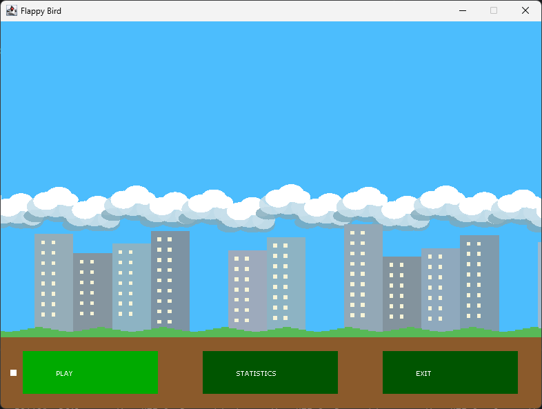
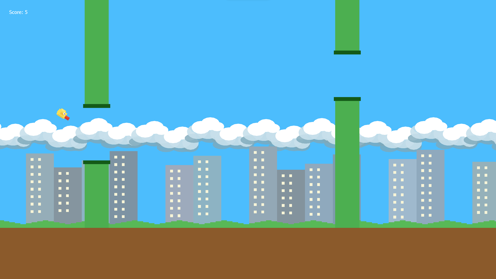
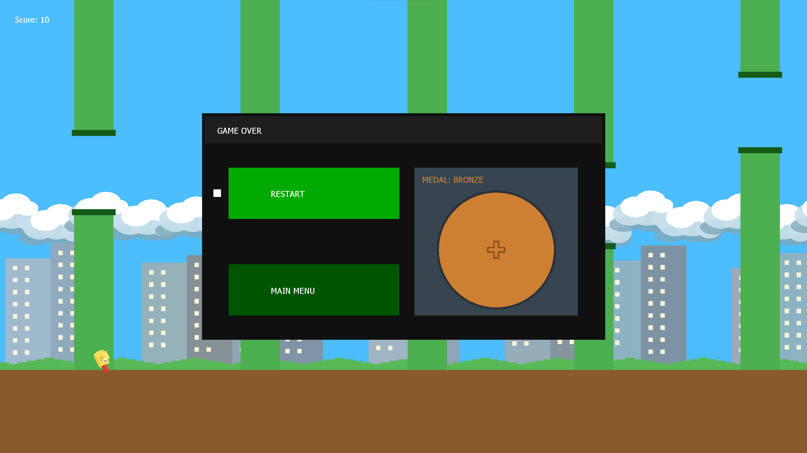
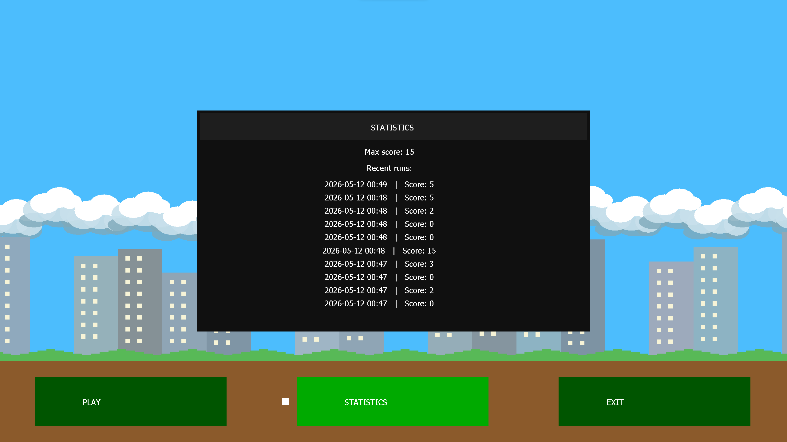

# Swing-Bird


Клон Flappy Bird на Java (Swing) с полноценным игровым циклом, кастомным рендерингом и системой сохранения статистики. Разработано в рамках дисциплины «Основы программной инженерии» (УлГТУ, ФИСТ).

## 📋Описание
В проекте реализован игровой цикл с целевым ограничением 144 FPS, собственный рендеринг поверх Swing и конечный автомат для управления состояниями игры. Локальная статистика сохраняется в файл `stats.json` (по умолчанию в директорию `~/.flappybird/`).

## 📕 Требования
- Java 21+
- Maven 3.8+

## 🚀Быстрый старт
### Запуск из IDE (рекомендуемый способ):
- Точка входа: `org.flappyBird.Main`

### Запуск из консоли после сборки (без настройки плагина `maven-jar-plugin`):

```Bash
cd FlappyBird
mvn clean compile
mvn exec:java -Dexec.mainClass="org.flappyBird.Main"
```
> Для корректной работы `exec:java` убедитесь, что плагин `exec-maven-plugin` добавлен в ваш `pom.xml`, либо запускайте скомпилированные классы вручную.

### Сборка проекта через Maven:

```bash
cd FlappyBird
mvn clean package
```

## 🕹️ Управление
- `SPACE` — прыжок.
- `ESC` — пауза / назад.
- `Стрелки` или `WASD` — навигация по UI.
- `ENTER` — подтверждение выбора.
- `F11` — полноэкранный режим.

## 🔑 Ключевые особенности
- Независимый от Swing игровой цикл.
- Командный рендеринг через `IRenderCmd` и буферизацию кадра.
- Машина состояний: меню, игра, пауза, сброс, статистика.
- Физика полета птицы, генерация труб и параллакс‑скроллинг.
- Безопасное сохранение статистики с `.tmp` и `.bak` (используется `jackson-databind`).

## ✒️ Структура проекта
- `org.flappyBird` — точка входа и окно приложения.
- `org.flappyBird.state` — состояния игры.
- `org.flappyBird.logic` — игровая логика и спавн труб.
- `org.flappyBird.entity` — сущности (птица, трубы).
- `org.flappyBird.component` — UI и параллакс.
- `org.flappyBird.render` — рендер-команды.
- `org.flappyBird.stats` — статистика.

## 🏗️ Архитектура
**Игровой движок и рендеринг**
- Целевое ограничение 144 FPS
- Кадр формируется в отдельном потоке, затем передается в UI‑поток и рисуется через `Graphics2D`

**Машина состояний**
- `MenuState`, `PlayingState`, `PauseState`, `ResetState`, `StatisticsState`
- Переходы управляются `StateController`

**Игровые механики**
- Гравитация и наклон птицы
- Процедурная генерация труб
- Многослойный параллакс‑фон

**Система статистики**
- Сохранение в `stats.json` в `~/.flappybird/`
- Механизм безопасной записи через `.tmp` и резервную `.bak`

## 📷 Скриншоты
**Main menu:**


**Gameplay:**


**Game over menu:**


**Statistics:**


## 📝 Лицензия
Это программное обеспечение распространяется по условиям лицензии MIT.
